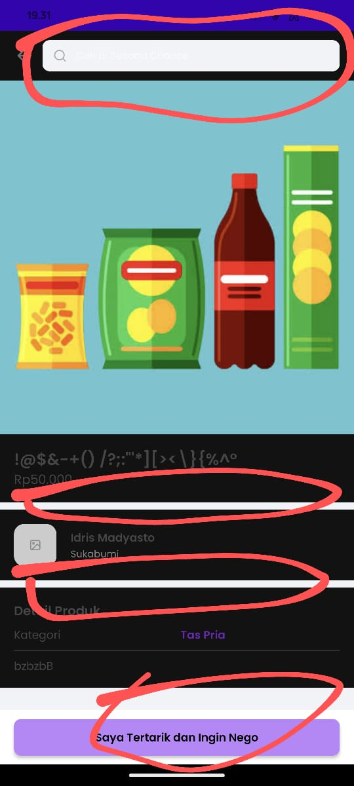

## Issue Type
Bug

## Bug ID
SH-AND-BUG-001

## Summary
White color still appears on product detail page in Dark Mode

## Platform
Mobile Application (Android)

## Environment
- Application: SecondHand Mobile App
- Device: Poco F4
- OS Version: Android 13

## Description
Some UI elements on the product detail page still appear white when Dark Mode is enabled, causing inconsistent appearance and poor readability.

## Preconditions
- Dark Mode is enabled on the device
- User is logged in

## Steps to Reproduce
1. Open the SecondHand mobile app
2. Tap any product from the homepage
3. Observe the product detail page in Dark Mode

## Expected Result
All UI elements should appear in dark colors consistent with Dark Mode.

## Actual Result
Some UI elements remain white in Dark Mode.

## Severity
Minor

## Priority
High

## Status
Open

## Fix Version
Not Assigned

## Evidence

