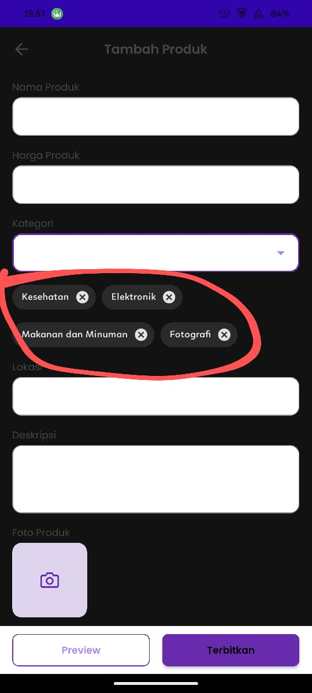

## Issue Type
Bug

## Bug ID
SH-AND-BUG-002

## Summary
Seller can select multiple categories when adding a product

## Platform
Mobile Application (Android)

## Environment
- Application: SecondHand Mobile App
- Device: Poco F4
- OS Version: Android 13

## Description
The category field allows sellers to select multiple categories, whereas only one category should be allowed.

## Preconditions
User is logged in as seller

## Steps to Reproduce
1. Open the SecondHand mobile app
2. Tap the **+** button
3. Navigate to the Add Product page
4. Select more than one category
5. Fill other required fields
6. Tap **Terbitkan**

## Expected Result
Seller should only be able to select one category.

## Actual Result
Seller can select multiple or all categories.

## Severity
Medium

## Priority
High

## Status
Open

## Fix Version
Not Assigned

## Evidence

