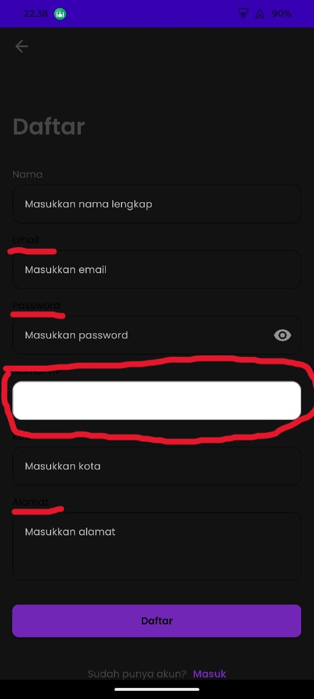

## Issue Type
Bug

## Bug ID
SH-AND-BUG-003

## Summary
Phone number field and labels display incorrect colors in Dark Mode during registration

## Platform
Mobile Application (Android)

## Environment
- Application: SecondHand Mobile App
- Device: Poco F4
- OS Version: Android 13

## Description
On the registration page, the phone number field appears white and some labels appear black in Dark Mode, reducing readability.

## Preconditions
Dark Mode is enabled

## Steps to Reproduce
1. Open the SecondHand mobile app
2. Tap **Akun**
3. Tap **Masuk**
4. Tap **Daftar**
5. Observe the phone number field and labels

## Expected Result
All input fields and labels should follow Dark Mode color standards.

## Actual Result
Phone number field appears white and labels appear black.

## Severity
Medium

## Priority
Medium

## Status
Open

## Fix Version
Not Assigned

## Evidence

