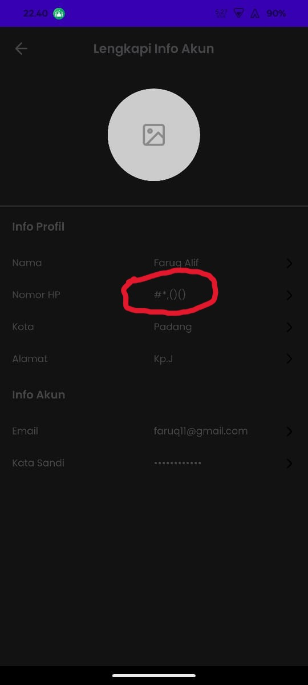

## Issue Type
Bug

## Bug ID
SH-AND-BUG-004

## Summary
Phone number field allows non-numeric characters during registration

## Platform
Mobile Application (Android)

## Environment
- Application: SecondHand Mobile App
- Device: Poco F4
- OS Version: Android 13

## Description
The phone number field accepts symbols and non-numeric characters, allowing invalid phone numbers to be submitted.

## Preconditions
User is on registration page

## Steps to Reproduce
1. Open the SecondHand mobile app
2. Navigate to **Daftar**
3. Fill all required fields
4. Enter symbols in the phone number field (e.g. #()*)
5. Tap **Daftar**

## Expected Result
Phone number field should accept numeric characters only.

## Actual Result
User can register using non-numeric phone numbers.

## Severity
Major

## Priority
High

## Status
Open

## Fix Version
Not Assigned

## Evidence

