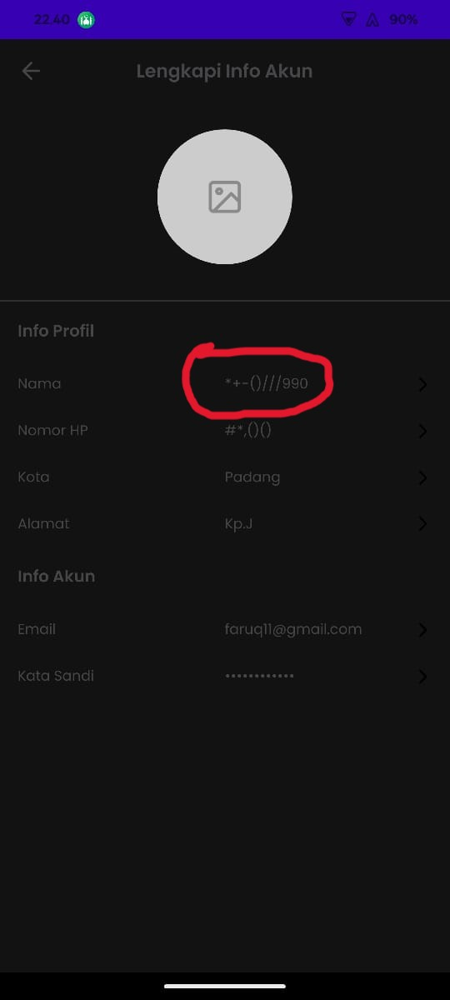

## Issue Type
Bug

## Bug ID
SH-AND-BUG-005

## Summary
Name field allows symbols and numbers during registration

## Platform
Mobile Application (Android)

## Environment
- Application: SecondHand Mobile App
- Device: Poco F4
- OS Version: Android 13

## Description
The name field allows users to register using only symbols and numbers, which should not be allowed.

## Preconditions
User is on registration page

## Steps to Reproduce
1. Open the SecondHand mobile app
2. Navigate to **Daftar**
3. Fill all required fields
4. Enter symbols and numbers in the name field (e.g. *+-()990)
5. Tap **Daftar**

## Expected Result
Name field should only allow alphabetic characters.

## Actual Result
User can register with symbols and numbers in the name field.

## Severity
Major

## Priority
High

## Status
Open

## Fix Version
Not Assigned

## Evidence

