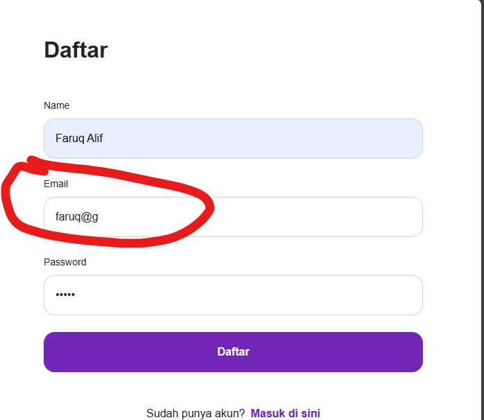

## Issue Type
Bug

## Bug ID
SH-WEB-BUG-001

## Summary
User can register using an invalid email domain

## Platform
Web Application

## Environment
- Application: SecondHand Web
- Browser: Microsoft Edge
- OS: Windows 10

## Description
The system allows users to register using an email address with an invalid domain (e.g. faruq@g).

## Preconditions
User is on the registration page

## Steps to Reproduce
1. Open SecondHand homepage
2. Click **Masuk**
3. Click **Daftar di sini**
4. Enter email with invalid domain (e.g. faruq@g)
5. Click **Daftar**

## Expected Result
User should only be able to register using a valid email domain (e.g. faruq@gmail.com).

## Actual Result
User is able to register using an invalid email domain.

## Severity
Major

## Priority
Low

## Status
Open

## Fix Version
Not Assigned

## Evidence

