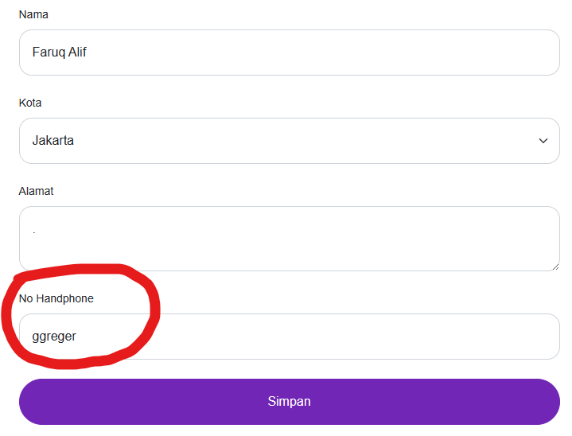

## Issue Type
Bug

## Bug ID
SH-WEB-BUG-002

## Summary
Phone number field allows non-numeric characters

## Platform
Web Application

## Environment
- Application: SecondHand Web
- Browser: Microsoft Edge
- OS: Windows 11

## Description
The phone number field allows alphabetic and special characters to be entered.

## Preconditions
User is logged in

## Steps to Reproduce
1. Open SecondHand homepage
2. Login with valid account
3. Click profile icon
4. Open **Complete Account Information**
5. Enter alphabet or symbols in phone number field
6. Click **Save**

## Expected Result
Phone number field should only accept numeric input.

## Actual Result
Phone number field accepts non-numeric characters.

## Severity
Medium

## Priority
High

## Status
Open

## Fix Version
Not Assigned

## Evidence

