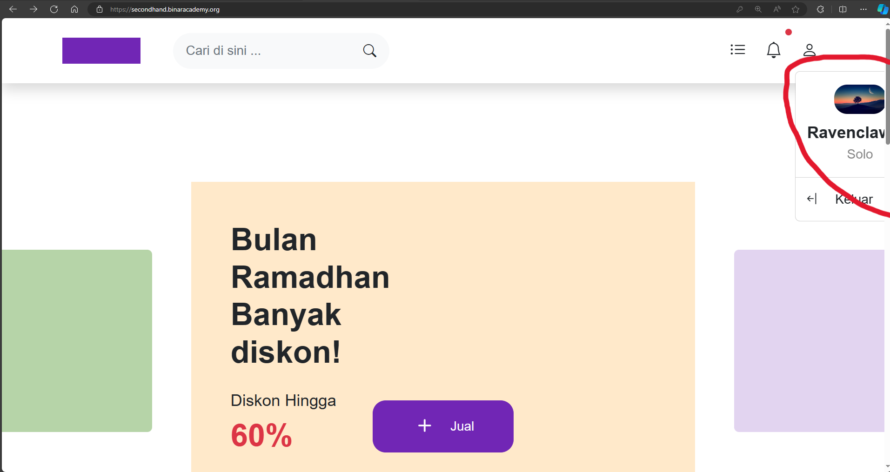

## Issue Type
Bug

## Bug ID
SH-WEB-BUG-004

## Summary
Profile photo appears cropped on homepage

## Platform
Web Application

## Environment
- Application: SecondHand Web
- Browser: Microsoft Edge
- OS: Windows 10

## Description
User profile photo appears cropped on the homepage after login.

## Preconditions
User is logged in

## Steps to Reproduce
1. Open SecondHand homepage
2. Login with valid account
3. Click profile icon

## Expected Result
Profile photo should be displayed correctly without being cropped.

## Actual Result
Profile photo is cropped.

## Severity
Medium

## Priority
Medium

## Status
Open

## Fix Version
Not Assigned

## Evidence

