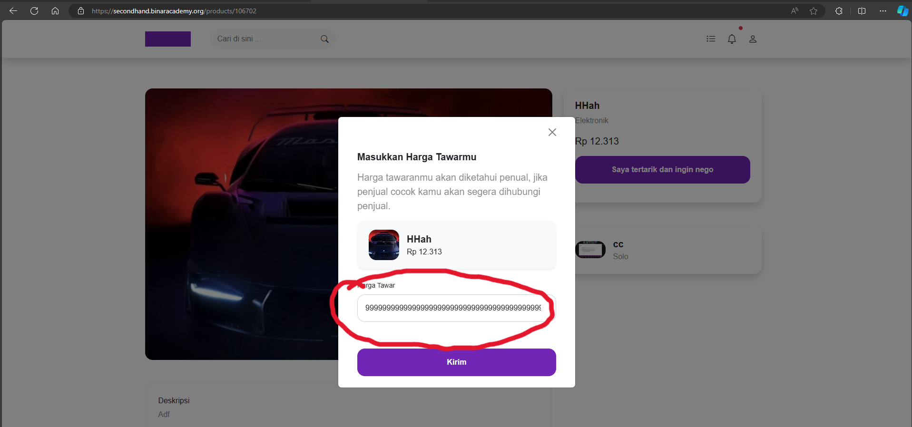

## Issue Type
Bug

## Bug ID
SH-WEB-BUG-005

## Summary
Negotiation price field allows unlimited digits

## Platform
Web Application

## Environment
- Application: SecondHand Web
- Browser: Microsoft Edge
- OS: Windows 11

## Description
The negotiation price field allows users to enter extremely long numeric values without limitation.

## Preconditions
User is logged in

## Steps to Reproduce
1. Open SecondHand homepage
2. Login with valid account
3. Open a product detail page
4. Click **Saya tertarik dan ingin nego**
5. Enter very long numeric value
6. Click **Kirim**

## Expected Result
Price input should be limited to a reasonable number of digits (e.g. max 8 digits).

## Actual Result
User can enter unlimited digits.

## Severity
Medium

## Priority
Low

## Status
Open

## Fix Version
Not Assigned

## Evidence

