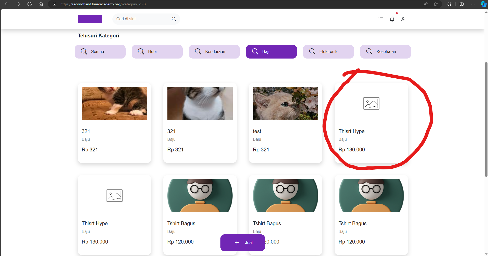

## Issue Type
Bug

## Bug ID
SH-WEB-BUG-006

## Summary
Seller can publish product without uploading photos

## Platform
Web Application

## Environment
- Application: SecondHand Web
- Browser: Microsoft Edge
- OS: Windows 11

## Description
Seller is able to publish a product without uploading any product photos.

## Preconditions
User is logged in as seller

## Steps to Reproduce
1. Open SecondHand homepage
2. Click **Jual**
3. Fill product details except photo
4. Click **Terbitkan**

## Expected Result
System should require at least one product photo before publishing.

## Actual Result
Product is successfully published without photos.

## Severity
Medium

## Priority
High

## Status
Open

## Fix Version
Not Assigned

## Evidence

