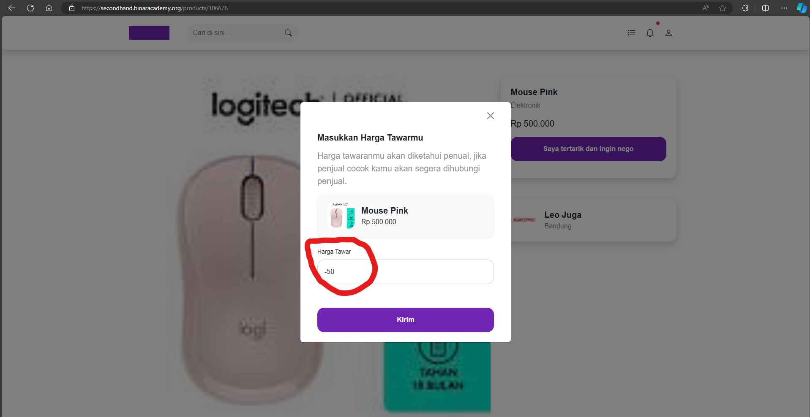

## Issue Type
Bug

## Bug ID
SH-WEB-BUG-007

## Summary
User can submit negative price during negotiation

## Platform
Web Application

## Environment
- Application: SecondHand Web
- Browser: Microsoft Edge
- OS: Windows 10

## Description
The negotiation price field allows negative values and special characters.

## Preconditions
User is logged in

## Steps to Reproduce
1. Open product detail page
2. Click **Saya tertarik dan ingin nego**
3. Enter negative price (e.g. -50)
4. Click **Kirim**

## Expected Result
System should not allow negative price or special characters.

## Actual Result
Negative price is accepted.

## Severity
Medium

## Priority
High

## Status
Open

## Fix Version
Not Assigned

## Evidence

