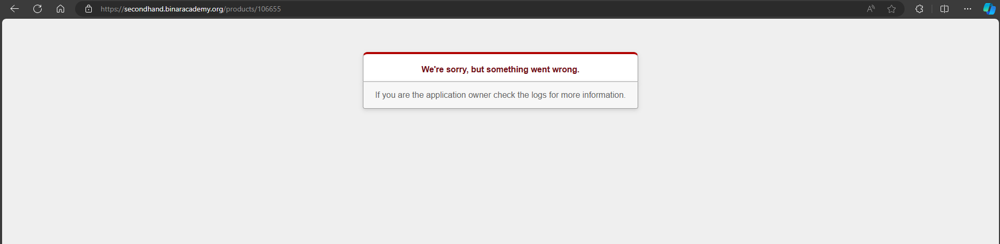

## Issue Type
Bug

## Bug ID
SH-WEB-BUG-008

## Summary
Error page appears when opening product without photo

## Platform
Web Application

## Environment
- Application: SecondHand Web
- Browser: Microsoft Edge
- OS: Windows 10

## Description
Opening a product without photo results in an error page.

## Preconditions
User is logged in

## Steps to Reproduce
1. Open SecondHand homepage
2. Click a product without photo

## Expected Result
User should be redirected to product detail page normally.

## Actual Result
Product page displays error or blank page.

## Severity
Major

## Priority
High

## Status
Open

## Fix Version
Not Assigned

## Evidence

