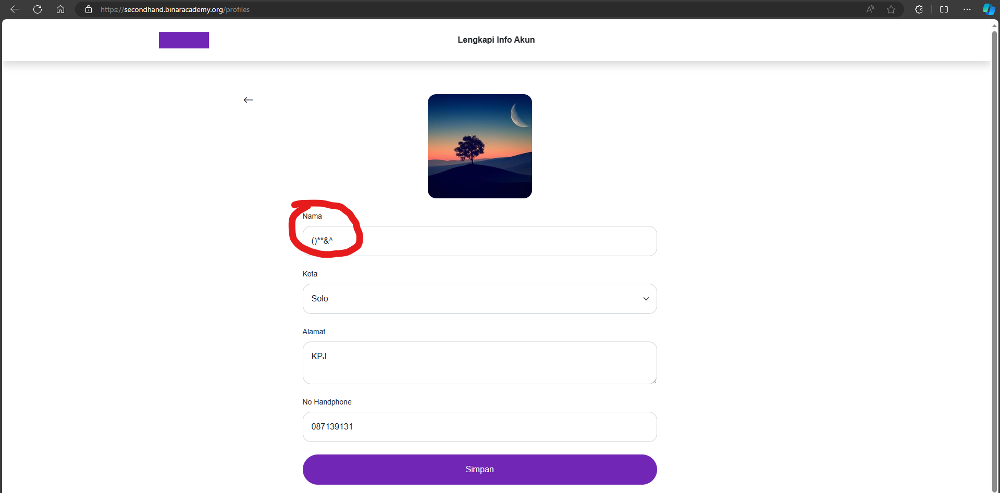

## Issue Type
Bug

## Bug ID
SH-WEB-BUG-009

## Summary
Name field allows symbols only

## Platform
Web Application

## Environment
- Application: SecondHand Web
- Browser: Microsoft Edge
- OS: Windows 11

## Description
The name field allows users to enter symbols instead of alphabetic characters.

## Preconditions
User is logged in

## Steps to Reproduce
1. Open profile page
2. Enter symbols in name field
3. Click **Save**

## Expected Result
Name field should only accept alphabetic characters.

## Actual Result
Symbols are accepted in name field.

## Severity
Medium

## Priority
High

## Status
Open

## Fix Version
Not Assigned

## Evidence

